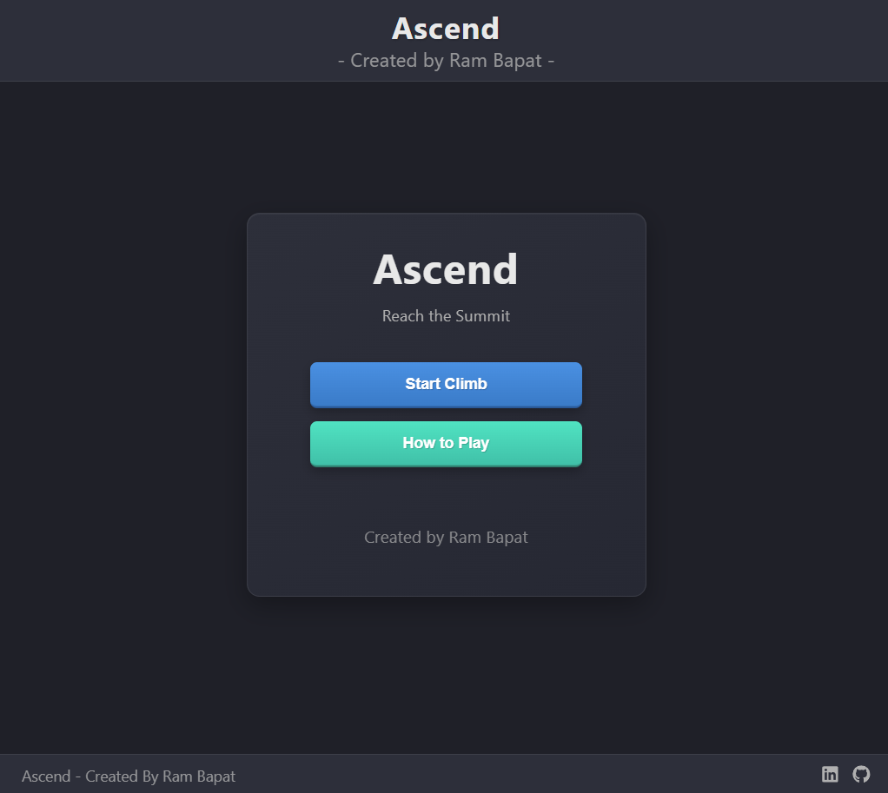
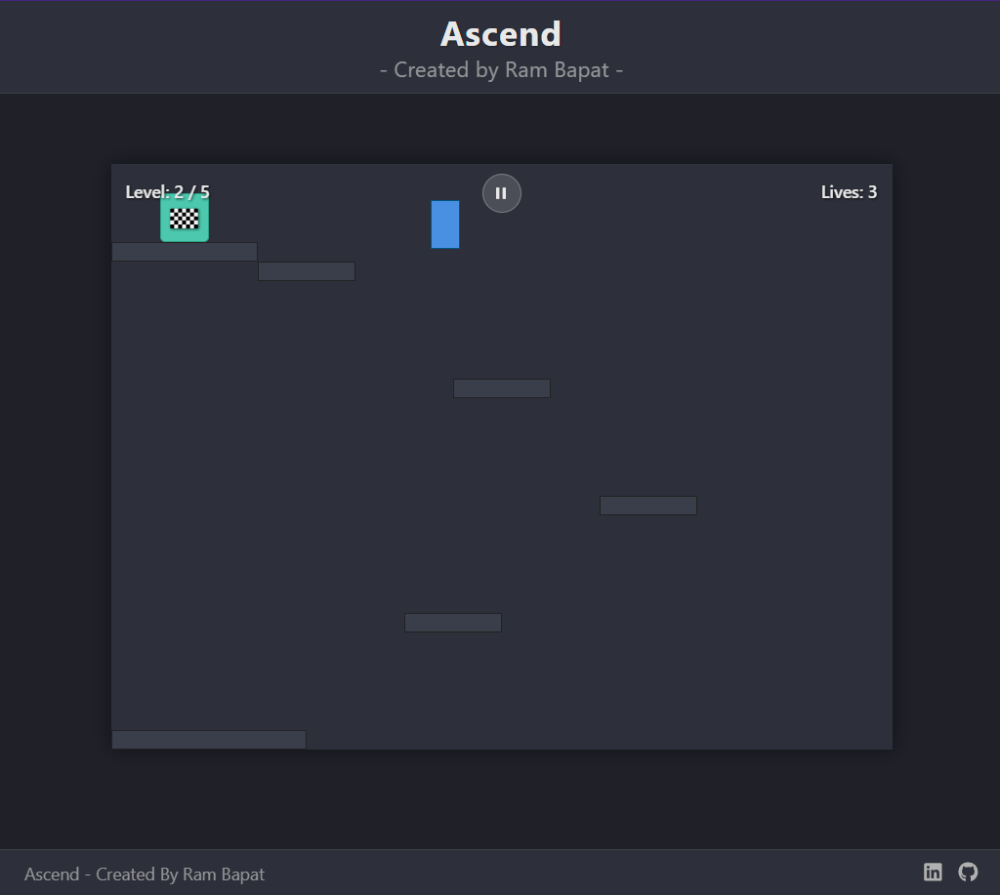
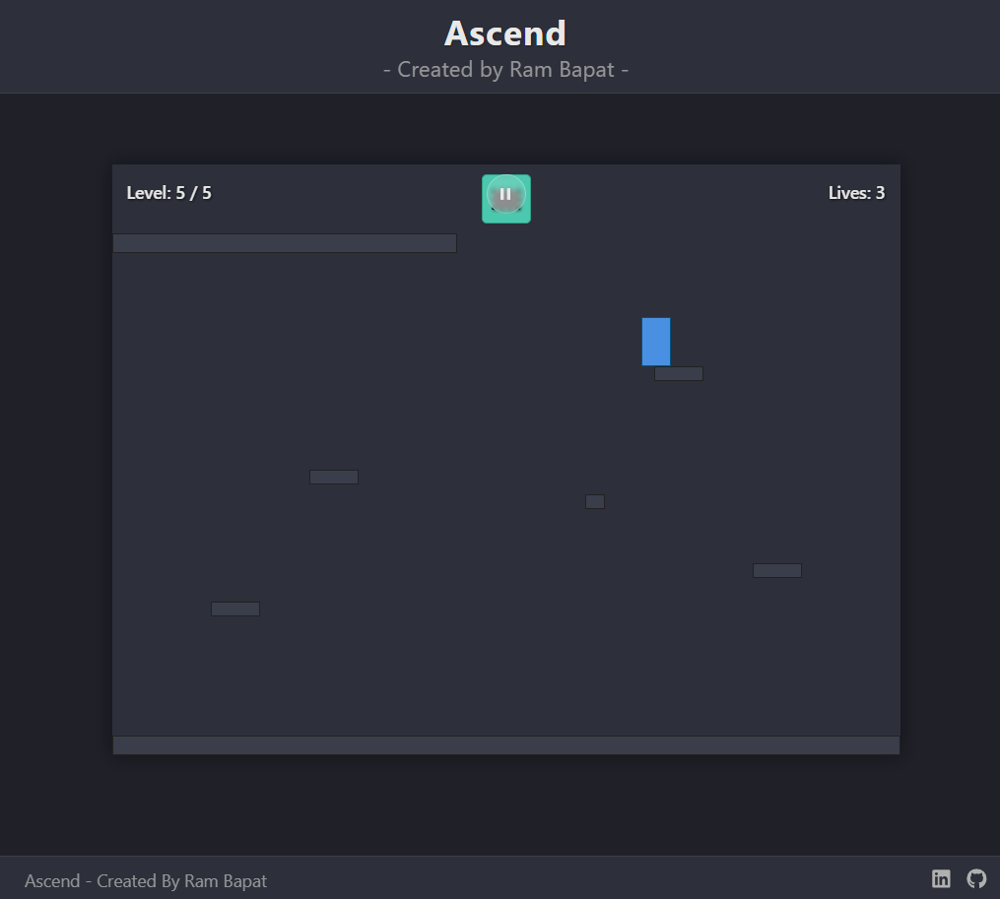
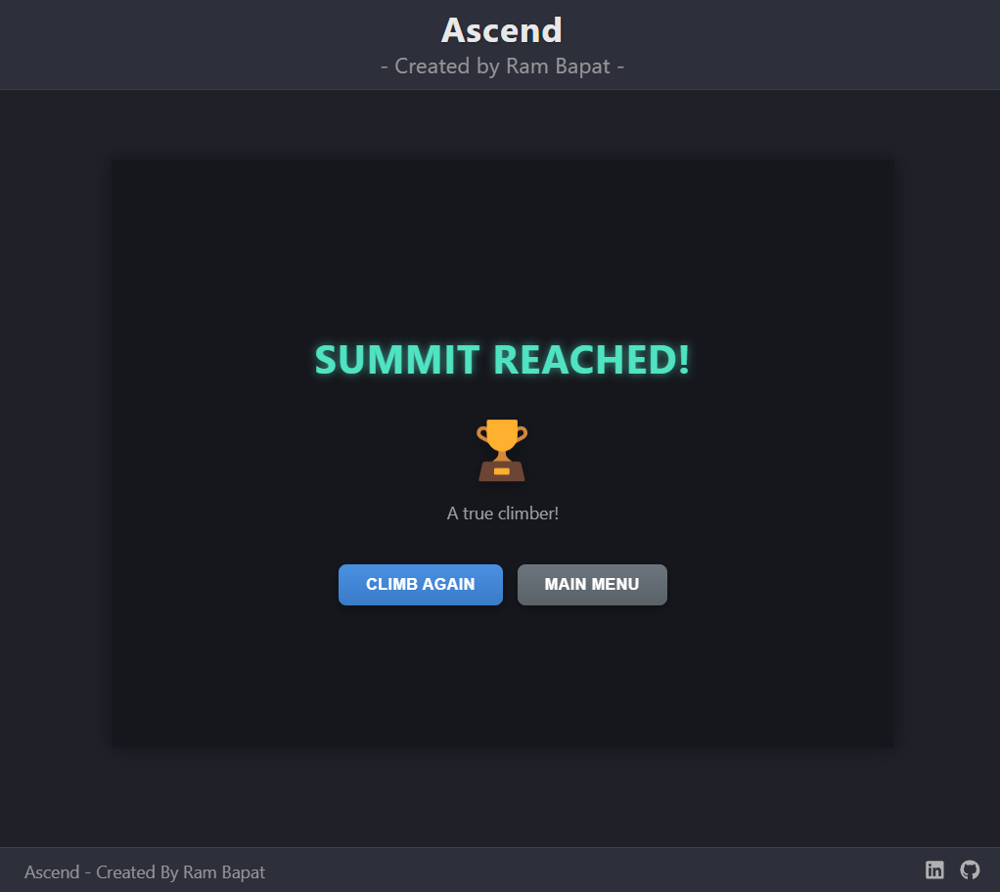

# Ascend - Dark Theme Platformer Game (React) 🚀🧗‍♂️✨

## Try the live demo - [Demo](https://ascend-platformer-game.vercel.app/)

A modern, dark-themed, 5-level platformer game built with React and Vite. Climb your way up, overcome obstacles, and reach the summit! Designed to be responsive and playable on desktop and mobile devices with touch controls.

This project was developed as part of the **#VibeCoding 30-Day Challenge (April 2025)**, leveraging AI assistance for coding, debugging, and feature implementation.

<!-- ================================================== -->






<!-- ================================================== -->

## Overview

"Ascend" is a minimalist yet engaging platformer where the primary goal across 5 distinct levels is simple: climb up and reach the goal flag at the top. The game features:

*   A sleek, modern dark theme.
*   Progressively challenging level design.
*   A life system (3 lives for the entire game).
*   Basic physics (gravity, jumping, movement).
*   Compatibility with both keyboard (Arrows/WASD + Space) and touch controls (virtual joystick + jump button).
*   Responsive scaling to fit various screen sizes, aiming for edge-to-edge width on mobile.
*   A pause menu with options to resume, view controls, or return to the main menu.

The development heavily utilized "Vibe Coding" principles, using AI as a partner to generate code snippets, brainstorm solutions, debug issues, and iterate on features quickly.

## Features

*   **5 Unique Levels:** Carefully designed levels with increasing difficulty.
*   **Core Platformer Mechanics:** Smooth player movement, jumping, and gravity simulation.
*   **Responsive Scaling:** Game area scales uniformly to fit the available screen space, prioritizing width on mobile.
*   **Dual Control Schemes:**
    *   **Keyboard:** Arrow keys or WASD for movement, Spacebar/W/Up Arrow for jumping. Escape/P for pause.
    *   **Touch:** On-screen virtual joystick for movement and a dedicated jump button.
*   **Life System:** Players have 3 lives; falling off platforms costs a life and restarts the current level.
*   **Pause Functionality:** In-game pause menu accessible via button or keyboard shortcut (Esc/P).
*   **How to Play Modal:** Accessible from Home Screen and Pause Menu.
*   **Win/Game Over Screens:** Clear feedback upon completing all levels or running out of lives.
*   **Fixed Header & Footer:** Provides consistent UI elements including game title, creator credit, and social links.
*   **Modern Tech Stack:** Built with React, Vite, and modern CSS.
*   **AI Collaboration:** Developed with significant assistance from AI for code generation, debugging, and feature implementation, embodying the #VibeCoding challenge spirit.

## Tech Stack

*   **Frontend:** React 18+
*   **Build Tool:** Vite
*   **Styling:** CSS3 (Flexbox, Grid, Custom Properties/Variables, Animations, calc())
*   **Language:** JavaScript (ES6+)
*   **Joystick:** [`react-joystick-component`](https://www.npmjs.com/package/react-joystick-component)
*   **Icons:** [`react-icons`](https://react-icons.github.io/react-icons/) (for Footer, Pause Button)
*   **SVG Handling:** [`vite-plugin-svgr`](https://github.com/pd4d10/vite-plugin-svgr)
*   **Package Manager:** npm

## Getting Started

To get a local copy up and running, follow these simple steps.

### Prerequisites

*   Node.js (v18 or later recommended) installed: [nodejs.org](https://nodejs.org/)
*   npm (comes with Node.js)
*   Git (optional, for cloning): [git-scm.com](https://git-scm.com/)

### Installation & Setup

1.  **Clone the repository:**
    ```bash
    git clone https://github.com/Barrsum/Ascend-Platformer-Game.git
    ```

2.  **Navigate to the project directory:**
    ```bash
    cd Ascend-Platformer-Game
    ```

3.  **Install NPM packages:**
    ```bash
    npm install
    ```

### Running the Project

1.  **Start the development server:**
    ```bash
    npm run dev
    ```
    This command will start the Vite development server.

2.  **Open the application:**
    Open your web browser and navigate to the local URL provided by Vite (usually `http://localhost:5173/` or a similar port).

## Contributing

Contributions, issues, and feature requests are welcome! This project is part of a learning challenge, but suggestions are appreciated.

1.  Fork the Project
2.  Create your Feature Branch (`git checkout -b feature/CoolImprovement`)
3.  Commit your Changes (`git commit -m 'Add some CoolImprovement'`)
4.  Push to the Branch (`git push origin feature/CoolImprovement`)
5.  Open a Pull Request

## License

Distributed under the MIT License. See `LICENSE.md` for more information.

## Acknowledgements

*   **React:** [react.dev](https://react.dev/)
*   **Vite:** [vitejs.dev](https://vitejs.dev/)
*   **React Joystick Component:** For the touch controls.
*   **React Icons:** For footer and UI icons.
*   **Vite Plugin SVGR:** For easy SVG handling.
*   **AI Assistance:** AI played a significant role in code generation, debugging, and iterative development throughout the #VibeCoding challenge.

---

Built by Ram Bapat - Challenge [\#30DaysOfVibeCoding](https://www.linkedin.com/posts/ram-bapat-barrsum-diamos_vibecoding-ai-machinelearning-activity-7312839191153860608-wQ8y?utm_source=share&utm_medium=member_desktop&rcm=ACoAAEokGUcBG1WEFP4A_IMlyO4LNl-eu2MD52w) - [LinkedIn Profile](https://www.linkedin.com/in/ram-bapat-barrsum-diamos)